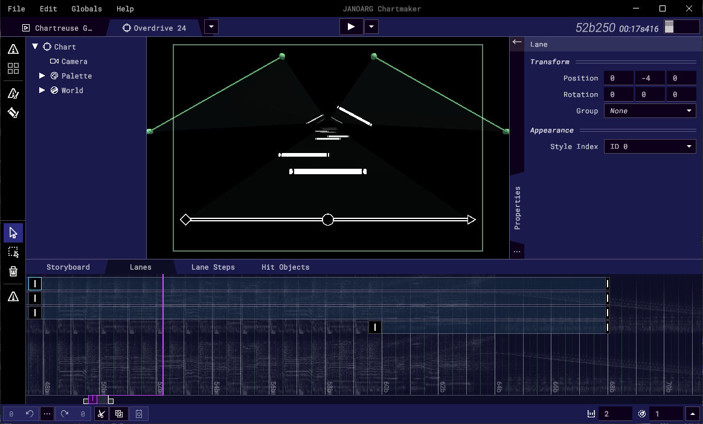

## JANOARG Chartmaker
*(**J**ust **A**nother **N**ormal, **O**rdinary, **A**cceptable **R**hythm **G**ame **Chartmaker**)*  
The chart editor for a rhythm game where everything can move.

## How to Contribute Code

### You'll need the following:
* A personal computer (Windows/Mac/Linux, the editor isn't available on mobile, sorry)
* A copy of Unity Editor (preferably version 2022.3.46)
* A code editor (any text editor should work)
* A copy of Git/Github Desktop is recommended so you can update/submit code easily

### Instructions
* Clone the project (by downloading it to your computer or by running the following command in the cmd/terminal: `git clone https://github.com/ducdat0507/JANOARG.git`).
* Open the root folder using the Unity Editor.
* Make edits to the code (of course)
* Send the project (by making a pull request)

## Contact
We have a [Discord server](https://discord.gg/vXJTPFQBHm) for discussions/official songlist submission! You can also share and receive charting tips I guess
