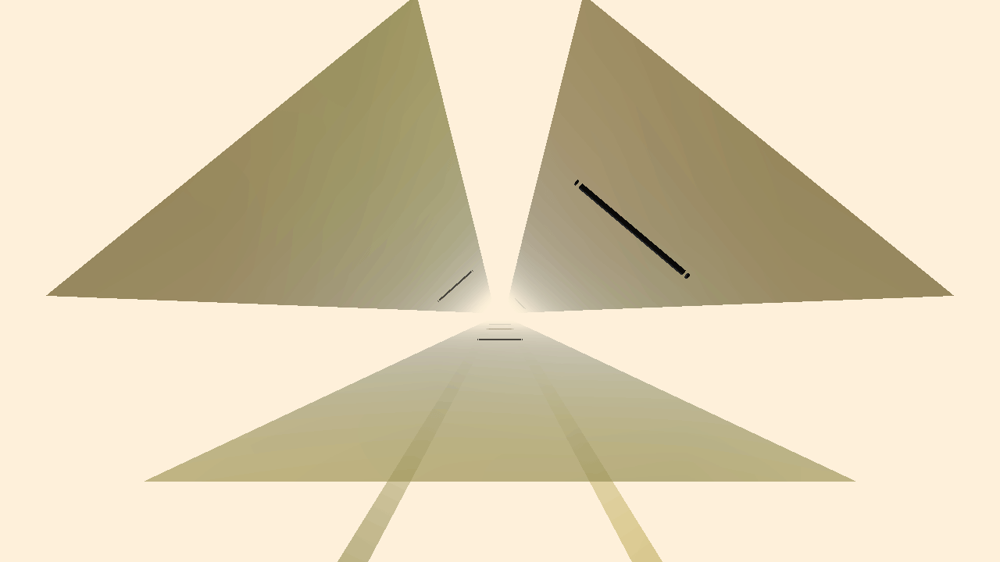

    <h2>J.A.N.O.A.R.G.</h2>
    <i>(Just Another Normal, Ordinary, Acceptable Rhythm Game)</i> 
    A rhythm game where everything can move.
      

## How to Contribute Code / Make Charts

### You'll need the following:
* A personal computer (Windows/Mac/Linux, the editor isn't available on mobile, sorry)
* A copy of Unity Editor (preferably version 2021.1)
* A code editor (any text editor should work)
* A copy of Git/Github Desktop is recommended so you can update/submit code easily

### Instructions
* Clone the project (by downloading it to your computer or by running the following command in the cmd/terminal: `git clone https://github.com/ducdat0507/JANOARG.git`).
* Open the root folder using the Unity Editor.
* If you want to make charts:
    * Put your music into the project. It is recommended to organize your charts by putting songs into separate folders inside `Assets/Resources/Songs` so the songs don't get included in commits (we currently do not accept song submissions through git).
    * Open the chartmaker: On the menu bar, click J.A.N.O.A.R.G. > Chartmaker
    * Enter your song's information in the fields below the "or create a new one" label.
    * Click the "Create New Chart" button. A file will be created inside the folder that the song is currently in.
    * Click the song name in the top left corner and press the "Create New Chart" button to make a new chart. You can create as many charts as you'd like.
* If you want to contribute code:
    * Make edits to the code (of course)
    * Send the project (by making a pull request)

## Contact
We have a [Discord server](https://discord.gg/vXJTPFQBHm) for discussions/official songlist submission
(guys i just need one song so i can make a proper preview video)
