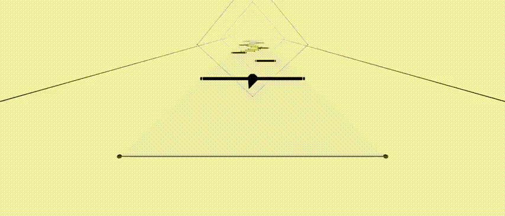

    
<h1>
     
</h1>
        
*(Just Another Normal, Ordinary, Acceptable Rhythm Game)*
    
A rhythm game where everything can move.

Preview <i>(epilepsy warning!)</i>

    

## Code contributing

### Requirement:
* **A copy of Unity Editor, version 2022.3.**
* **A text editor that can edit code.** Even rudimentary ones like Notepad can do, though we recommend ones that support full Unity and C# integration such as [JetBrains Rider](https://www.jetbrains.com/rider/) or [Visual Studio Code](https://code.visualstudio.com/).

## Additional contributing (No programming skills required)
As of now, we had plenty of song entry, but we are lacking of charters. We would like your help to fill the gaps! You can get started by installing [the chartmaker](https://github.com/FFF40/JANOARG-Chartmaker/releases) which is available for all (desktop) platforms, and joining the Discord server (link's down below).

You can also submit your song and chart (that you made, obviously) to be used in the game, with [Google Form](https://forms.gle/HJsLRGxSC8rExwFFA).

## Contact
[FFF40 Studios Discord server](https://discord.gg/vXJTPFQBHm)
